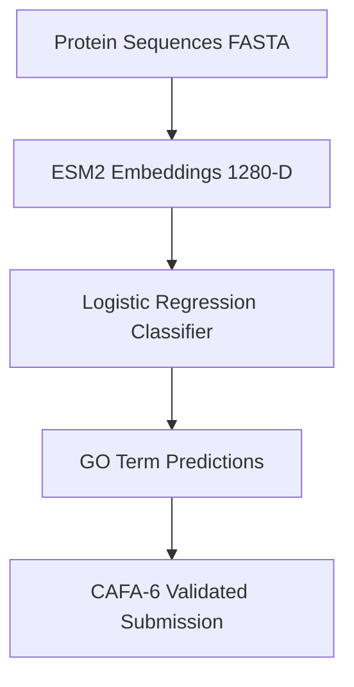

# CAFA-6 Protein Function Prediction

**Author:** *Caleb Mwangi*  
**Tagline:** *Bio-ML — Mapping sequence to function*  
**Competition:** CAFA-6: Predicting Protein Function From Sequence

---

##  Project Overview

This project predicts **Gene Ontology (GO)** terms for novel proteins using **protein language models**.  
I used **ESM2 (35M params)** to generate embeddings, then trained a **multi-output Logistic Regression** classifier to perform multi-label biological function prediction.

 Public Leaderboard: *Position 427 on Global Leader board*  
 Final submission file: `submission.tsv`

---

## 🧬 Workflow Architecture



---

## 🏗️ Model Details

| Component | Choice | Notes |
|----------|--------|------|
| Embedding Model | ESM2-T12-35M-UR50D | CPU trained (16GB RAM) |
| Features | 1280-dim embeddings | One per protein |
| Classifier | MultiOutput Logistic Regression | Balanced class weights |
| Training Time | ~48 hours | Local CPU |
| Evaluation | Micro F1 = **0.1770** | Phase-2 Validation |

Embedding extraction was accelerated using **Alibaba Cloud T4 GPU**.

---

## 📁 Repository Contents

- **notebooks/**
  - Full training + inference workflow
  - Reusable Python modules
- **submission/** uploaded prediction file
- MIT License (2025)

---

## 🧩 Example Prediction Output

Format: `entry_id   GO_term   probability`

```
A0A0B4J2F2    GO:0005515    0.812
A0A5C2NZW3    GO:0016021    0.601
```

---

## 📌 How to Reproduce Locally

```bash
# Clone repository
git clone https://github.com/<your-username>/cafa6-protein-function-prediction.git
cd cafa6-protein-function-prediction

# Install dependencies
pip install -r requirements.txt
```

---
## 🏅 Kaggle Submission

File:  
`submission/submission.tsv`  

Competition:  
CAFA-6 Protein Function Prediction Challenge

---

## ▶️ Future Improvements

| Idea | Benefit |
|------|---------|
| Fine-tuning ESM model | Higher task-specific performance |
| Add GO hierarchy propagation | Better biological validity |
| Include Deep Learning classifier | Improved recall |
| Use GPUs for full-scale training | Much faster experimentation |

---

## 📜 License

MIT License — see `LICENSE`

---

**Bio-ML — Mapping sequence to function** 🧬  
